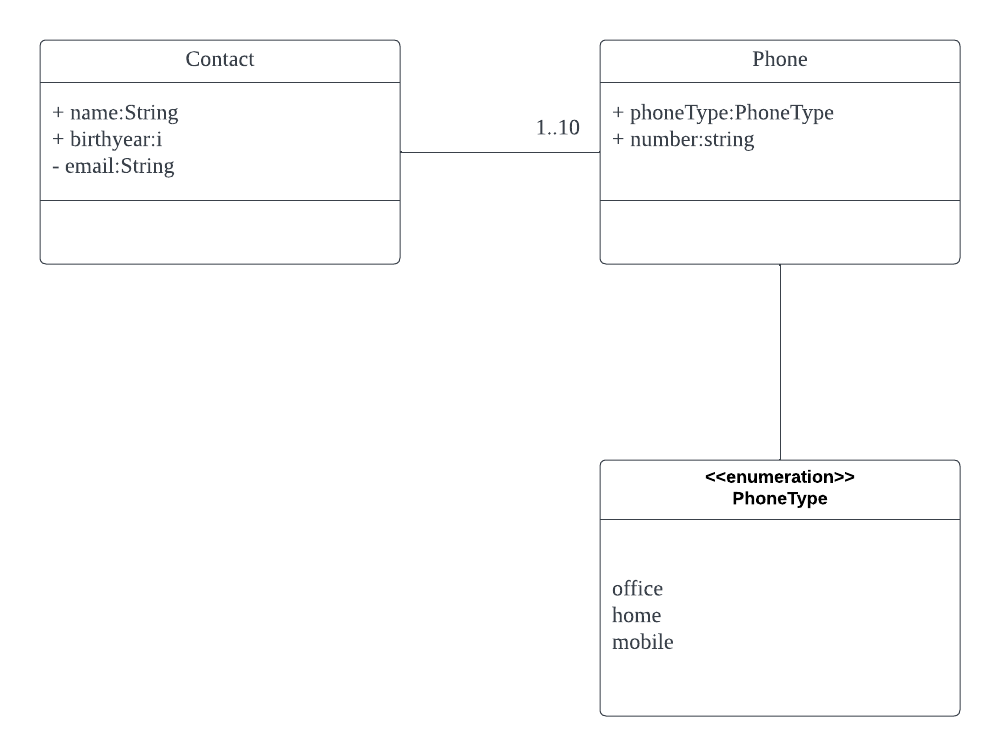

# Mongoose CRUD operations
## Overview
This example demonstrates the use of ODM ([Mongooese v7](https://mongoosejs.com)).





1. Learn how to prepare a *schema* to describe entities and their relationships.
1. Study the examples of how to create, read, update and delete documents.
1. Learn how to use built-in *validators* to enforce data consistency and integrity.

## Running this example using Docker
1. Download the Docker images for Node.js and MongoDB
```
docker pull mongo:latest
docker pull node:latest
```
2. Start MongoDB
```
docker run -itd --name mongo -p 27017:27017 mongo --auth
```
3. Create a MongoDB user
```
docker exec -it mongo mongo admin
# create user: 'admin' and its password: 123456
>  db.createUser({ user:'admin',pwd:'123456',roles:[ { role:'userAdminAnyDatabase', db: 'admin'},"readWriteAnyDatabase"]});
# Try to login as admin
> db.auth('admin', '123456')
```
4. Obtain the IP address of the MongoDB server
```
docker inspect mongo | grep IP
```
5. Update the IP address in [server.js](./server.js) stored in the `mongouri` variable
6. Start Nodejs
```
docker run -itd -v <folder>:/<folder> --name node node
```
Replace `<folder>` with the full path of the folder that contains `server.js`
7. Run the example
```
docker exec -it node /bin/bash
cd /<folder>
node server.js
```